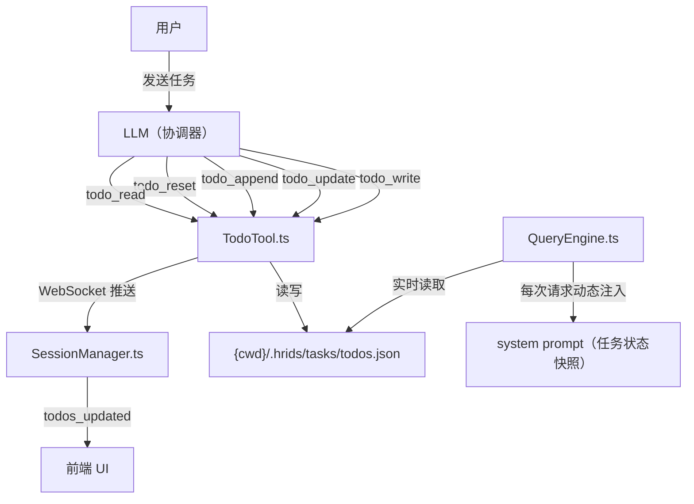
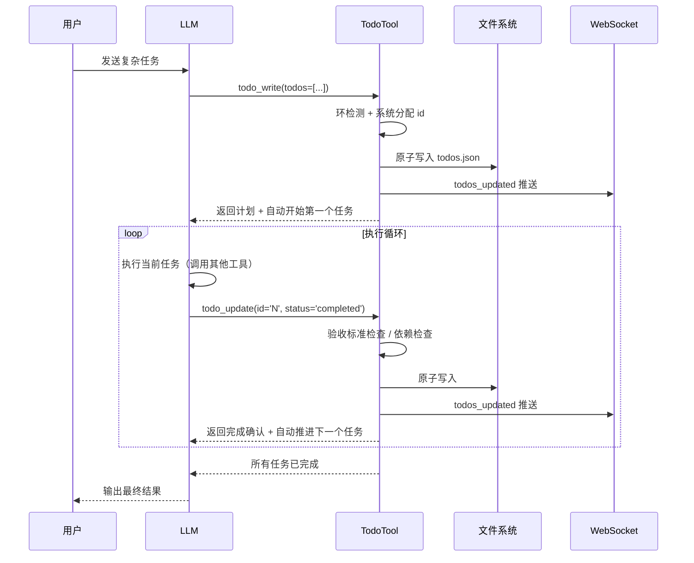

# 设计文档：任务管理系统（todo-system）

## 概述

为 hrids-agent 设计一套全新的任务管理系统，解决 LLM 在执行复杂任务时的五个核心失控点：**计划被覆盖**、**执行停滞**、**过早完成**、**压缩后漂移**、**范围失控**。

系统通过接口设计（而非 prompt 约束）物理阻止错误行为，工具返回值驱动执行循环，用状态机替代规则列表，让 LLM 在任何时刻只需知道"现在该调用哪个工具、传什么参数"。

## 架构



## 主要流程时序图



## 组件与接口

### 组件一：TodoTool.ts

**用途**：实现全部 5 个任务管理工具，是系统的核心模块。

**接口**：

```typescript
// 对外导出供其他模块使用
export function loadTodos(): Todo[]
export function setTodosUpdatedCallback(cb: () => void): void

// 5 个工具实例
export const TodoWriteTool: ToolDef<...>
export const TodoUpdateTool: ToolDef<...>
export const TodoAppendTool: ToolDef<...>
export const TodoResetTool: ToolDef<...>
export const TodoReadTool: ToolDef<...>
```

**职责**：
- 管理 `{cwd}/.hrids/tasks/todos.json` 的读写（原子写入）
- 系统自增 id 分配（LLM 不传 id）
- 有向图环检测（`todo_write` 和 `todo_append` 写入前调用）
- 验收标准强制确认机制
- 依赖约束检查
- 按优先级自动推进下一个任务
- 触发 WebSocket 推送回调

### 组件二：QueryEngine.ts（修改）

**用途**：每次 LLM 请求前动态注入当前任务状态到 system prompt 末尾。

**接口**：

```typescript
function buildLiveTodoContext(): string | null
// 在 streamOneTurn() 内部构建临时 systemPromptForThisTurn，不修改共享引用
```

**职责**：
- 实时读取 `todos.json`，构建任务状态快照字符串
- 对 `in_progress` 任务注入完整的 `acceptance`、`context`、`dependsOn` 信息
- 无活跃任务时不注入，避免无意义 token 消耗
- 每次请求独立构建，不受上下文压缩影响

### 组件三：SessionManager.ts（修改）

**用途**：注册 `todos_updated` WebSocket 推送回调。

**职责**：
- 从新 `TodoTool.ts` 导入 `setTodosUpdatedCallback`
- 注册推送回调，向前端广播 `todos_updated` 事件
- `todo_reset` 的决策推送复用 `gatewayDecisionCallbacks` / `sessionDecisionResolves` 机制

### 组件四：coordinatorPrompt.ts（修改）

**用途**：将 `SECTION_TODO` 替换为状态机描述。

**职责**：
- 描述完整的工具调用状态机（当前状态 → 唯一正确的下一步）
- 加入规划确认的判断标准（高/低不确定性路径）
- 更新工具速查表

## 数据模型

### Todo

```typescript
interface Todo {
  // 核心字段（必须）
  id: string                                        // 系统自增，格式 "1", "2", "3"...
  content: string                                   // 任务内容
  status: 'pending' | 'in_progress' | 'completed'  // 状态
  priority: 'high' | 'medium' | 'low'              // 优先级，影响排序
  createdAt: number                                 // 创建时间戳（ms）

  // 质量保障字段（可选）
  acceptance?: string[]   // 验收标准，完成前逐条确认
  dependsOn?: string[]    // 依赖的任务 id，依赖未完成时不能开始
  context?: string        // 任务背景/来源，压缩后意图锚点
}
```

**验证规则**：
- `id`：系统分配，LLM 不可传入，格式为正整数字符串
- `content`：非空字符串
- `status`：枚举值，只允许三个固定值
- `priority`：枚举值，只允许三个固定值
- `dependsOn`：只能引用已存在的任务 id，不能形成有向环
- `acceptance` + `confirmations`：长度必须一致，且全部为 `true` 才能标记完成

### 存储结构

```
{cwd}/
└── .hrids/
    └── tasks/
        ├── todos.json              ← 主任务列表
        └── todos.bak.{timestamp}.json  ← 重置前自动备份
```

**路径解析**：

```typescript
import { resolve } from 'path'
import { getGlobalCwd } from './BashTool.js'

function getTodoFile(): string {
  return resolve(getGlobalCwd(), '.hrids', 'tasks', 'todos.json')
}
```

## 工具接口详细规格

### todo_write — 建立计划

```typescript
inputSchema: z.strictObject({
  todos: z.array(z.strictObject({
    content:    z.string(),
    priority:   z.enum(['high', 'medium', 'low']),
    acceptance: z.array(z.string()).optional(),
    dependsOn:  z.array(z.string()).optional(),
    context:    z.string().optional(),
  })).min(1)
})
```

**前置条件**：
- `todos.json` 不存在或为空列表
- `todos` 数组长度 ≥ 1
- `dependsOn` 中的 id 不形成有向环

**后置条件**：
- 所有任务已写入文件，系统分配递增 id
- 第一个任务自动标记为 `in_progress`
- WebSocket 推送 `todos_updated`
- 返回值包含完整计划列表和下一步指令

**错误情况**：
- 列表已存在且非空 → 返回错误 + 当前计划，提示使用 `todo_append` 或 `todo_update`
- 存在循环依赖 → 返回错误 + 具体循环链路

### todo_update — 更新单条状态

```typescript
inputSchema: z.strictObject({
  id:            z.string(),
  status:        z.enum(['in_progress', 'completed']),
  confirmations: z.array(z.boolean()).optional(),
})
```

**前置条件**：
- `id` 对应的任务存在
- 标记 `in_progress` 时：`dependsOn` 中所有任务均为 `completed`
- 标记 `completed` 且有 `acceptance` 时：`confirmations` 长度与 `acceptance` 一致且全部为 `true`

**后置条件**：
- 标记 `in_progress`：其他 `in_progress` 任务自动降为 `pending`，保证同一时刻最多一个 `in_progress`
- 标记 `completed`（无验收标准）：自动将下一个 `pending` 任务（按 high→medium→low，同优先级按 id 顺序）标记为 `in_progress`
- 标记 `completed`（有验收标准，confirmations 全部 true）：同上，自动推进
- WebSocket 推送 `todos_updated`

**错误情况**：
- id 不存在 → 返回错误，提示调用 `todo_read` 确认
- 依赖未完成 → 返回错误 + 具体依赖信息
- 有 `acceptance` 但未提供 `confirmations` → 返回带索引的验收清单，不标记完成

### todo_append — 追加新任务

```typescript
inputSchema: z.strictObject({
  todos: z.array(z.strictObject({
    content:    z.string(),
    priority:   z.enum(['high', 'medium', 'low']),
    acceptance: z.array(z.string()).optional(),
    dependsOn:  z.array(z.string()).optional(),
    context:    z.string().optional(),
  })).min(1),
})
```

**前置条件**：
- `dependsOn` 只引用已存在的任务 id
- 新任务的 `dependsOn` 不与现有任务形成有向环

**后置条件**：
- 新任务追加到列表末尾，id = 当前最大 id + 1（递增）
- 不影响已有任务状态
- WebSocket 推送 `todos_updated`
- 返回值提示继续执行当前任务，不切换

### todo_reset — 请求重置计划

```typescript
inputSchema: z.strictObject({
  reason:  z.string(),
  newPlan: z.string().optional(),
})
```

**前置条件**：
- 任务列表非空

**执行流程**：
1. 自动备份当前列表到 `todos.bak.{timestamp}.json`
2. 触发 `resolveDecision` 机制，向用户展示重置请求
3. 等待用户决策（超时 5 分钟自动视为拒绝）
4. 用户允许 → 清空列表，返回提示调用 `todo_write`
5. 用户拒绝 → 保留列表，返回当前执行中任务信息

**错误情况**：
- 列表为空 → 返回错误："当前没有任务计划，无需重置"

### todo_read — 读取状态

```typescript
inputSchema: z.strictObject({})  // 无参数
```

**后置条件**：
- 只读操作，不修改任何状态
- 列表为空时返回提示调用 `todo_write`
- 列表非空时返回：未完成任务（按优先级排序）+ 最近 3 条已完成任务 + 当前执行中任务的下一步指令

## 关键算法

### 系统自增 id 分配

```pascal
FUNCTION assignIds(newTodos, existingTodos)
  INPUT: newTodos（无 id 的新任务列表），existingTodos（现有任务列表）
  OUTPUT: newTodos（已分配 id）

  maxId ← 0
  FOR each todo IN existingTodos DO
    IF toNumber(todo.id) > maxId THEN
      maxId ← toNumber(todo.id)
    END IF
  END FOR

  FOR i ← 0 TO length(newTodos) - 1 DO
    newTodos[i].id ← toString(maxId + i + 1)
  END FOR

  RETURN newTodos
END FUNCTION
```

**循环不变量**：每次迭代后，已处理的任务 id 均大于 existingTodos 中所有任务的 id。

### 有向图环检测

```pascal
FUNCTION detectCycle(allTodos)
  INPUT: allTodos（包含新任务的完整列表）
  OUTPUT: hasCycle（boolean），cyclePath（string，循环链路描述）

  // 构建邻接表
  graph ← Map<id, dependsOn[]>
  FOR each todo IN allTodos DO
    graph[todo.id] ← todo.dependsOn ?? []
  END FOR

  visited ← Set()
  inStack ← Set()

  FUNCTION dfs(nodeId, path)
    IF nodeId IN inStack THEN
      RETURN true, formatCyclePath(path, nodeId)
    END IF
    IF nodeId IN visited THEN
      RETURN false, null
    END IF

    visited.add(nodeId)
    inStack.add(nodeId)

    FOR each neighbor IN graph[nodeId] DO
      hasCycle, cyclePath ← dfs(neighbor, path + [nodeId])
      IF hasCycle THEN
        RETURN true, cyclePath
      END IF
    END FOR

    inStack.remove(nodeId)
    RETURN false, null
  END FUNCTION

  FOR each id IN graph.keys() DO
    IF id NOT IN visited THEN
      hasCycle, cyclePath ← dfs(id, [])
      IF hasCycle THEN
        RETURN true, cyclePath
      END IF
    END IF
  END FOR

  RETURN false, null
END FUNCTION
```

**前置条件**：`allTodos` 中每个 `dependsOn` 引用的 id 均存在于列表中。
**后置条件**：若返回 `hasCycle = true`，`cyclePath` 包含具体的循环链路（如 "任务 A → B → A"）。

### 原子写入

```pascal
PROCEDURE saveTodos(todos, filePath)
  INPUT: todos（任务列表），filePath（目标路径）

  tmpPath ← filePath + '.tmp'
  content ← JSON.stringify(todos, null, 2)

  writeFileSync(tmpPath, content, 'utf-8')
  renameSync(tmpPath, filePath)  // 原子替换，防止半写损坏
END PROCEDURE
```

### 按优先级自动推进

```pascal
FUNCTION findNextPending(todos)
  INPUT: todos（完整任务列表）
  OUTPUT: nextTodo（下一个可开始的任务）或 null

  // 按优先级分组：high → medium → low
  FOR each priority IN ['high', 'medium', 'low'] DO
    candidates ← todos.filter(t =>
      t.status = 'pending'
      AND t.priority = priority
      AND allDependenciesCompleted(t, todos)
    )
    // 同优先级按 id 升序
    candidates.sort(by id ascending)
    IF candidates.length > 0 THEN
      RETURN candidates[0]
    END IF
  END FOR

  RETURN null
END FUNCTION
```

**循环不变量**：每次迭代只考虑当前优先级的候选任务，高优先级任务始终优先于低优先级任务。

### 压缩恢复：动态注入 system prompt

```pascal
FUNCTION buildLiveTodoContext()
  OUTPUT: contextString（string）或 null

  TRY
    todos ← loadTodos()
    active ← todos.filter(t => t.status ≠ 'completed')
    IF active.length = 0 THEN
      RETURN null
    END IF

    completed ← todos.filter(t => t.status = 'completed').length
    lines ← ['## 当前任务状态（实时）', '进度：' + completed + '/' + todos.length]

    FOR each t IN active DO
      icon ← IF t.status = 'in_progress' THEN '▸' ELSE '○'
      lines.append(icon + ' [' + t.id + '] ' + t.content)

      IF t.status = 'in_progress' THEN
        IF t.context THEN lines.append('  背景：' + t.context)
        IF t.acceptance THEN
          lines.append('  验收标准：')
          FOR i, a IN enumerate(t.acceptance) DO
            lines.append('    □ [' + i + '] ' + a)
          END FOR
        END IF
      END IF
    END FOR

    inProgress ← active.find(t => t.status = 'in_progress')
    IF inProgress THEN
      lines.append('当前执行中：「' + inProgress.content + '」（id: ' + inProgress.id + '）')
      // 附带下一步调用指令
    END IF

    RETURN lines.join('\n')
  CATCH
    RETURN null  // 文件不存在或读取失败时静默跳过
  END TRY
END FUNCTION
```

**前置条件**：`{cwd}/.hrids/tasks/todos.json` 可能存在也可能不存在（容错处理）。
**后置条件**：返回值在 `streamOneTurn()` 中追加到临时 `systemPromptForThisTurn` 数组，不修改 `this.config.systemPrompt` 共享引用。

## 错误处理

### 错误场景一：任务列表已存在时调用 todo_write

**条件**：`todos.json` 存在且包含至少一个任务
**响应**：返回错误信息 + 当前计划快照
**恢复**：提示使用 `todo_append` 追加或 `todo_update` 更新状态

### 错误场景二：循环依赖

**条件**：`todo_write` 或 `todo_append` 时 `dependsOn` 形成有向环
**响应**：返回错误 + 具体循环链路（如 "任务 1 → 3 → 1 形成循环"）
**恢复**：LLM 修正 `dependsOn` 后重新调用

### 错误场景三：依赖未完成时标记 in_progress

**条件**：`todo_update(id, 'in_progress')` 时 `dependsOn` 中存在非 `completed` 任务
**响应**：返回错误 + 具体依赖任务信息和当前状态
**恢复**：先完成依赖任务，再开始当前任务

### 错误场景四：验收标准未全部确认

**条件**：`todo_update(id, 'completed')` 时有 `acceptance` 但 `confirmations` 未全部为 `true`
**响应**：返回带索引的验收清单，不标记完成
**恢复**：LLM 逐条核对后附带 `confirmations: [true, true, ...]` 重新调用

### 错误场景五：任务 id 不存在

**条件**：`todo_update` 或其他工具传入不存在的 id
**响应**：返回错误，提示调用 `todo_read` 确认当前列表
**恢复**：调用 `todo_read` 获取最新状态后重试

### 错误场景六：文件读写失败

**条件**：`todos.json` 读写时发生 I/O 错误
**响应**：返回错误信息，不影响系统其他功能
**恢复**：静默跳过（`buildLiveTodoContext` 中），或返回错误信息（写操作中）

## 测试策略

### 单元测试

- `detectCycle()`：空图、线性链、有环图、多个独立子图
- `assignIds()`：空列表、追加到已有列表、id 连续性
- `saveTodos()` / `loadTodos()`：正常读写、原子写入（模拟中断）
- `findNextPending()`：按优先级排序、依赖过滤、全部完成时返回 null
- `buildLiveTodoContext()`：空列表、有活跃任务、文件不存在时容错

### 基于属性的测试

**测试库**：fast-check

**属性 1：计划不可被 LLM 自行覆盖**
```
对于任意非空的 todos 列表，
调用 todo_write 后，
原有任务列表不变，返回错误信息。
```

**属性 2：id 单调递增且系统分配**
```
对于任意 todo_write 或 todo_append 调用，
新任务的 id 均大于现有列表中所有任务的 id，
且 id 序列无间隔（连续递增）。
```

**属性 3：同一时刻最多一个 in_progress**
```
对于任意 todo_update(id, 'in_progress') 调用，
执行后列表中 status 为 in_progress 的任务有且仅有一个。
```

**属性 4：依赖约束**
```
对于任意有 dependsOn 字段的任务，
在其依赖的所有任务均为 completed 之前，
调用 todo_update(id, 'in_progress') 返回错误。
```

**属性 5：验收标准强制确认**
```
对于任意有 acceptance 字段的任务，
调用 todo_update(id, 'completed') 时，
若 confirmations 未全部为 true，系统拒绝标记完成。
```

**属性 8：无循环依赖**
```
对于任意 todo_write 或 todo_append 调用，
若 dependsOn 形成有向环，系统拒绝写入。
写入成功的任务列表中不存在循环依赖。
```

**属性 9：任务状态在每次 LLM 请求中可见**
```
对于任意存在活跃任务的状态，
buildLiveTodoContext() 返回非 null 字符串，
且包含所有 in_progress 任务的 id、content、acceptance。
```

## 正确性属性

*属性是在系统所有合法执行中都应成立的特征或行为——本质上是对系统应做什么的形式化陈述。属性是人类可读规格与机器可验证正确性保证之间的桥梁。*

### 属性 1：计划不可被 LLM 自行覆盖

*对于任意*非空的 Task_List，调用 `todo_write` 后，原有任务列表保持不变，系统返回错误信息。重置必须经过 `todo_reset` → 用户确认 → 清空的完整流程。

**验证：需求 1.2**

---

### 属性 2：id 单调递增且系统分配

*对于任意* `todo_write` 或 `todo_append` 调用，新任务的 id 均大于当前 Task_List 中所有任务的 id，且 id 序列连续递增（无间隔）。LLM 无法通过输入参数指定 id。

**验证：需求 2.1、2.2、2.3、2.4**

---

### 属性 3：同一时刻最多一个 in_progress

*对于任意* `todo_update(id, 'in_progress')` 调用，执行后 Task_List 中 status 为 `in_progress` 的任务有且仅有一个。

**验证：需求 3.1、3.2**

---

### 属性 4：依赖约束

*对于任意*有 `dependsOn` 字段的任务，在其依赖的所有任务均为 `completed` 之前，调用 `todo_update(id, 'in_progress')` 返回错误，不修改任务状态。

**验证：需求 4.1、4.2**

---

### 属性 5：验收标准强制确认

*对于任意*有 `acceptance` 字段的任务，调用 `todo_update(id, 'completed')` 时，若 `confirmations` 未提供、长度不匹配或存在 `false` 值，系统拒绝标记完成并返回带索引的验收清单。

**验证：需求 5.1、5.2、5.3、5.4**

---

### 属性 6：无循环依赖

*对于任意* `todo_write` 或 `todo_append` 调用，若新任务的 `dependsOn` 与现有任务形成有向环，系统拒绝写入并返回具体循环链路。写入成功的 Task_List 中 Dependency_Graph 不包含任何有向环。

**验证：需求 6.1、6.2、6.3**

---

### 属性 7：自动推进，最短工具调用路径

*对于任意* `todo_write` 成功调用，第一个任务自动标记为 `in_progress`，无需 LLM 额外调用 `todo_update`。*对于任意* `todo_update(id, 'completed')` 成功调用（无验收标准或验收全部通过），下一个满足依赖条件的 `pending` 任务自动标记为 `in_progress`。

**验证：需求 1.3、3.3、3.4**

---

### 属性 8：追加不影响已有任务

*对于任意* `todo_append` 调用，执行后 Task_List 中已有任务的所有字段（id、content、status、priority、acceptance、dependsOn、context、createdAt）保持不变。

**验证：需求 7.1**

---

### 属性 9：任务状态在每次 LLM 请求中可见

*对于任意*存在活跃任务（`pending` 或 `in_progress`）的状态，`buildLiveTodoContext()` 返回非 null 字符串，且包含所有 `in_progress` 任务的 id、content 及完整的 `acceptance`、`context` 信息。该注入每次请求实时读取文件，不受上下文压缩影响。

**验证：需求 10.1、10.2、10.3、10.4**

### 集成测试

- 完整执行循环：`todo_write` → 多次 `todo_update(completed)` → 所有任务完成
- 带依赖的执行顺序：依赖任务完成前无法开始后续任务
- 重置流程：`todo_reset` → 用户允许 → `todo_write` 建立新计划
- 压缩恢复：模拟上下文压缩后，`buildLiveTodoContext()` 仍能正确注入状态
- WebSocket 推送：每次写操作后前端收到 `todos_updated` 事件

## 性能考量

- **原子写入**：使用临时文件 + `rename` 替换，防止并发写入时文件半写损坏，与 `SessionStore.ts` 的 `meta.json` 写入模式一致
- **动态注入不参与 prompt cache**：任务状态是动态层，`cache_control` 只打在静态层元素上，每次请求重新发送，这是预期行为
- **`todo_read` 默认截断**：只展示未完成任务 + 最近 3 条已完成，避免长列表占用过多 token
- **无活跃任务时不注入**：`buildLiveTodoContext()` 在无活跃任务时返回 `null`，不向 system prompt 追加内容

## 安全考量

- **LLM 不可直接重置计划**：`todo_reset` 必须经过用户确认，防止 LLM 绕过进度保护
- **重置前自动备份**：备份到 `todos.bak.{timestamp}.json`，支持手动回滚
- **决策超时保护**：`todo_reset` 等待用户决策超时 5 分钟自动视为拒绝，LLM 继续执行原计划
- **schema 严格验证**：所有工具使用 `z.strictObject()`，LLM 传入非法字段时在 schema 层直接拒绝
- **路径安全**：使用 `resolve(getGlobalCwd(), ...)` 解析路径，遵循工具开发规范

## 依赖

- **zod**：工具 inputSchema 验证（`z.strictObject()`、枚举约束）
- **path**（Node.js 内置）：`resolve()` 路径解析
- **fs**（Node.js 内置）：`writeFileSync`、`renameSync`、`readFileSync`、`mkdirSync`
- **`getGlobalCwd()`**：来自 `./BashTool.js`，解析持久化工作目录
- **`auditLog()`**：来自 `../core/audit.js`，写操作审计日志
- **`resolveDecision` 机制**：来自 `DecisionTool` 底层基础设施，供 `todo_reset` 复用
- **WebSocket 推送**：通过 `setTodosUpdatedCallback` 注册回调，由 `SessionManager` 实现

## 实现计划

1. **新建 `src/tools/TodoTool.ts`**（全新文件，不改造旧文件）
   - 实现 `getTodoFile()`、`loadTodos()`、`saveTodos()`（原子写入）
   - 实现系统自增 id、有向图环检测 `detectCycle()`
   - 实现 5 个工具：`todo_write`、`todo_update`、`todo_append`、`todo_reset`、`todo_read`
   - 导出 `loadTodos` 和 `setTodosUpdatedCallback`

2. **更新 `src/tools/index.ts`**
   - 移除旧 `TodoWriteTool`、`TodoReadTool` 的导入和注册
   - 注册新的 5 个工具

3. **更新 `src/core/coordinator/coordinatorPrompt.ts`**
   - 将 `SECTION_TODO` 替换为状态机描述
   - 加入规划确认判断标准和工具速查表

4. **更新 `src/core/QueryEngine.ts`**
   - 实现 `buildLiveTodoContext()`
   - 在 `streamOneTurn()` 中动态注入任务状态到临时 system prompt

5. **更新 `src/gateway/SessionManager.ts`**
   - 更新 `setTodosUpdatedCallback` 的 import 来源

6. **更新前端类型定义 `src/web/src/lib/types.ts`**
   - `Todo` 接口新增 `acceptance`、`dependsOn`、`context`、`createdAt` 字段

7. **删除旧文件**
   - 新工具稳定后删除 `src/tools/TodoWriteTool.ts`

8. **更新前端 TodoItem 组件（可选）**
   - 若有 `acceptance` 字段，展示验收标准列表
