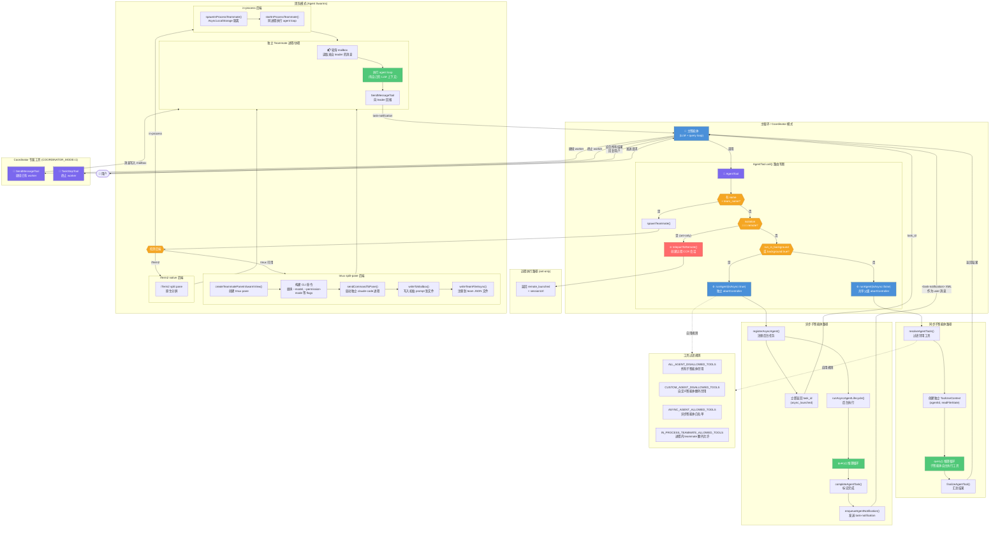

# Claude Code 多智能体协调流程图

```mermaid
flowchart TD
    User(["👤 用户"])
    User -->|"发送请求"| MainAgent

    subgraph MainLoop["主循环 / Coordinator 模式"]
        MainAgent["🧠 主智能体\n(LLM + query loop)"]
        MainAgent -->|"调用"| AgentTool

        subgraph AgentToolDecision["AgentTool.call() 路由判断"]
            AgentTool["🔧 AgentTool"]
            AgentTool --> Q1{{"有 name\n+ team_name?"}}
            Q1 -->|"是"| SpawnTeammate
            Q1 -->|"否"| Q2{{"isolation\n=== remote?"}}
            Q2 -->|"是 (ant-only)"| RemoteCCR
            Q2 -->|"否"| Q3{{"run_in_background\n或 background:true?"}}
            Q3 -->|"是"| AsyncAgent
            Q3 -->|"否"| SyncAgent
        end
    end

    %% ── 同步子智能体 ──
    subgraph SyncPath["同步子智能体路径"]
        SyncAgent["⚙️ runAgent(isAsync=false)\n共享父级 abortController"]
        SyncAgent --> ResolveTools1["resolveAgentTools()\n过滤禁用工具"]
        ResolveTools1 --> BuildCtx1["创建独立 ToolUseContext\n(agentId, readFileState)"]
        BuildCtx1 --> QueryLoop1["query() 推理循环\n子智能体自主执行工具"]
        QueryLoop1 --> FinalizeSync["finalizeAgentTool()\n汇总结果"]
        FinalizeSync -->|"返回结果"| MainAgent
    end

    %% ── 异步子智能体 ──
    subgraph AsyncPath["异步子智能体路径"]
        AsyncAgent["⚙️ runAgent(isAsync=true)\n独立 abortController"]
        AsyncAgent --> RegisterTask["registerAsyncAgent()\n注册后台任务"]
        RegisterTask --> ReturnTaskId["立即返回 task_id\n(async_launched)"]
        ReturnTaskId -->|"task_id"| MainAgent
        RegisterTask --> AsyncLoop["runAsyncAgentLifecycle()\n后台执行"]
        AsyncLoop --> QueryLoop2["query() 推理循环"]
        QueryLoop2 --> CompleteTask["completeAgentTask()\n标记完成"]
        CompleteTask --> Notification["enqueueAgentNotification()\n发送 task-notification"]
        Notification -->|"&lt;task-notification&gt; XML\n作为 user 消息"| MainAgent
    end

    %% ── 远程 CCR ──
    subgraph RemotePath["远程执行路径 (ant-only)"]
        RemoteCCR["🌐 teleportToRemote()\n创建远程 CCR 会话"]
        RemoteCCR --> RemoteResult["返回 remote_launched\n+ sessionUrl"]
    end

    %% ── 团队模式 ──
    subgraph TeamPath["团队模式 (Agent Swarms)"]
        SpawnTeammate["spawnTeammate()"]
        SpawnTeammate --> BackendDetect{{"检测后端"}}

        BackendDetect -->|"tmux 可用"| TmuxSplit
        BackendDetect -->|"iTerm2"| ITermSplit
        BackendDetect -->|"in-process"| InProcess

        subgraph TmuxSplit["tmux split-pane 后端"]
            T1["createTeammatePaneInSwarmView()\n创建 tmux pane"]
            T1 --> T2["构建 CLI 命令\n继承 --model, --permission-mode 等 flags"]
            T2 --> T3["sendCommandToPane()\n启动独立 claude-code 进程"]
            T3 --> T4["writeToMailbox()\n写入初始 prompt 到文件"]
            T4 --> T5["writeTeamFileAsync()\n注册到 team JSON 文件"]
        end

        subgraph ITermSplit["iTerm2 native 后端"]
            I1["iTerm2 split pane\n原生分屏"]
        end

        subgraph InProcess["in-process 后端"]
            P1["spawnInProcessTeammate()\nAsyncLocalStorage 隔离"]
            P1 --> P2["startInProcessTeammate()\n同进程执行 agent loop"]
        end

        TmuxSplit --> TeammateProc
        ITermSplit --> TeammateProc
        InProcess --> TeammateProc

        subgraph TeammateProc["独立 Teammate 进程/协程"]
            TP1["📬 轮询 mailbox\n读取来自 leader 的消息"]
            TP1 --> TP2["执行 agent loop\n(有自己的 LLM 上下文)"]
            TP2 --> TP3["SendMessageTool\n向 leader 回报"]
            TP3 -->|"task-notification"| MainAgent
        end
    end

    %% ── Coordinator 专属工具 ──
    subgraph CoordinatorTools["Coordinator 专属工具 (COORDINATOR_MODE=1)"]
        SendMsg["📨 SendMessageTool\n继续已有 worker"]
        TaskStop["🛑 TaskStopTool\n终止 worker"]
        MainAgent -->|"继续 worker"| SendMsg
        MainAgent -->|"终止 worker"| TaskStop
        SendMsg -->|"消息写入 mailbox"| TeammateProc
    end

    %% ── 权限与工具过滤 ──
    subgraph ToolFilter["工具过滤规则"]
        F1["ALL_AGENT_DISALLOWED_TOOLS\n所有子智能体禁用"]
        F2["CUSTOM_AGENT_DISALLOWED_TOOLS\n自定义智能体额外禁用"]
        F3["ASYNC_AGENT_ALLOWED_TOOLS\n异步智能体白名单"]
        F4["IN_PROCESS_TEAMMATE_ALLOWED_TOOLS\n进程内 teammate 额外允许"]
    end

    ResolveTools1 -.->|"应用规则"| ToolFilter
    AsyncAgent -.->|"应用规则"| ToolFilter

    %% ── 结果返回用户 ──
    MainAgent -->|"综合所有结果\n回复用户"| User

    %% 样式
    classDef agent fill:#4A90D9,stroke:#2C5F8A,color:#fff
    classDef tool fill:#7B68EE,stroke:#5A4DB0,color:#fff
    classDef decision fill:#F5A623,stroke:#C47D0E,color:#fff
    classDef process fill:#50C878,stroke:#2E8B57,color:#fff
    classDef external fill:#FF6B6B,stroke:#CC0000,color:#fff

    class MainAgent,SyncAgent,AsyncAgent agent
    class AgentTool,SendMsg,TaskStop tool
    class Q1,Q2,Q3,BackendDetect decision
    class QueryLoop1,QueryLoop2,TP2 process
    class RemoteCCR external
```
